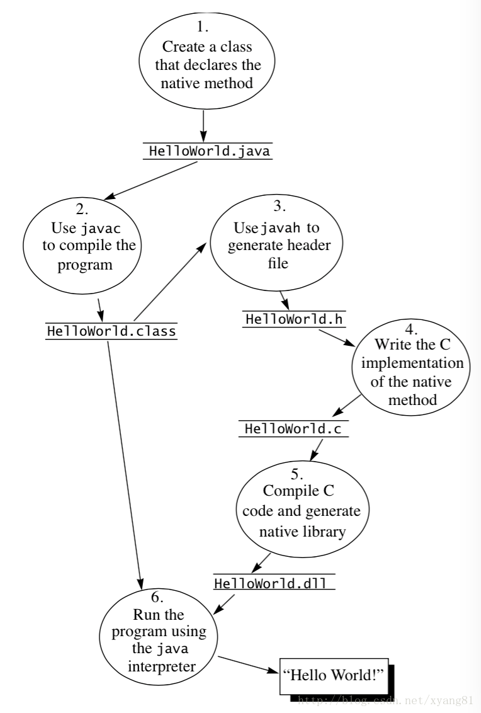

# Java调C/C++

## 操作

JNI开发流程主要分为以下6步：

1、编写声明了native方法的Java类

2、将Java源代码编译成class字节码文件

3、用javah -jni命令生成.h头文件（javah是jdk自带的一个命令，-jni参数表示将class中用native声明的函数生成jni规则的函数）

4、用本地代码实现.h头文件中的函数

5、将本地代码编译成动态库（windows：*.dll，linux/unix：*.so，mac os x：*.jnilib）

6、拷贝动态库至 java.library.path 本地库搜索目录下，并运行Java程序



### 第一步、新建一个HelloWorld.java源文件

```java
package com.study.jnilearn;
 
public class HelloWorld {
	
	public static native String sayHello(String name); 	// 声明，这是一个native静态函数，由本地代码实现
	public static native int add(int x, int y);	// 静态求和函数
	public native int addArray(int[] arr); // 非静态数组求和函数

 
	public static void main(String[] args) {
		System.out.println("JVM查找的动态库目录如下：");
		String libraryDirs = System.getProperty("java.library.path");
		System.out.println(libraryDirs);

		// 调用本地函数
		String text = sayHello("Hello World");
		System.out.println(text);

		int res = add(1, 2);
		System.out.println("[Java]:call add()\n" + res);

		// 测试非静态方法与类
		HelloWorld hello = new HelloWorld();
		int[] arr = {1, 2, 3, 4, 5};
		res = hello.addArray(arr);
		System.out.println("[Java]:call addArray()\n" + res);


		System.out.println("\n");
	}

	static {
		//System.loadLibrary("HelloWorld");	// 加载实现了native函数的动态库，只需要写动态库的名字
		System.load("/home/user/gitme/android/JNI/JavaCallNativeCplus/jni/libHelloWorld.so");
	}
}

```

### 第二步、用javac命令将.java源文件编译成.class字节码文件

注意：HelloWorld放在com.study.jnilearn包下面

```shell
javac src/com/study/jnilearn/HelloWorld.java -d ./bin
```

-d 表示将编译后的class文件放到指定的目录下，这里我把它放到和src同级的bin目录下

### 第三步、用javah -jni命令，根据class字节码文件生成.h头文件（-jni参数是可选的）

```shell
javah -jni -classpath ./bin -d ./jni com.study.jnilearn.HelloWorld
```

默认生成的.h头文件名为：com_study_jnilearn_HelloWorld.h（包名+类名.h），也可以通过-o参数指定生成头文件名称：

```shell
javah -jni -classpath ./bin -o HelloWorld.h com.study.jnilearn.HelloWorld
```

参数说明：

-classpath ：类搜索路径，这里表示从当前的bin目录下查找

-d ：将生成的头文件放到当前的jni目录下

-o ： 指定生成的头文件名称，默认以类全路径名生成（包名+类名.h）

注意：-d和-o只能使用其中一个参数。

### 第四步、用本地代码实现.h头文件中的函数

`com_study_jnilearn_HelloWorld.h`：

```c++
/* DO NOT EDIT THIS FILE - it is machine generated */
#include <jni.h>
/* Header for class com_study_jnilearn_HelloWorld */

#ifndef _Included_com_study_jnilearn_HelloWorld
#define _Included_com_study_jnilearn_HelloWorld
#ifdef __cplusplus
extern "C" {
#endif
/*
 * Class:     com_study_jnilearn_HelloWorld
 * Method:    sayHello
 * Signature: (Ljava/lang/String;)Ljava/lang/String;
 */
JNIEXPORT jstring JNICALL Java_com_study_jnilearn_HelloWorld_sayHello
  (JNIEnv *, jclass, jstring);

/*
 * Class:     com_study_jnilearn_HelloWorld
 * Method:    add
 * Signature: (II)I
 */
JNIEXPORT jint JNICALL Java_com_study_jnilearn_HelloWorld_add
  (JNIEnv *, jclass, jint, jint);

/*
 * Class:     com_study_jnilearn_HelloWorld
 * Method:    addArray
 * Signature: ([I)I
 */
JNIEXPORT jint JNICALL Java_com_study_jnilearn_HelloWorld_addArray
  (JNIEnv *, jobject, jintArray);

#ifdef __cplusplus
}
#endif
#endif

```

HelloWorld.cpp：

```c++
// HelloWorld.cpp

#include "com_study_jnilearn_HelloWorld.h"
 
#ifdef __cplusplus
extern "C"
{
#endif
 
/*
 * Class:     com_study_jnilearn_HelloWorld
 * Method:    sayHello
 * Signature: (Ljava/lang/String;)Ljava/lang/String;
 */
JNIEXPORT jstring JNICALL Java_com_study_jnilearn_HelloWorld_sayHello(
	JNIEnv *env, jclass cls, jstring j_str)
{
	printf("[native]: call sayhello()\n");
	const char *c_str = NULL;
	char buff[128] = { 0 };
	c_str = env->GetStringUTFChars(j_str, NULL);
	if (c_str == NULL)
	{
		printf("out of memory.\n");
		return NULL;
	}

	sprintf(buff, "[native]:%s\n", c_str);
    env->ReleaseStringUTFChars(j_str, c_str);
	return env->NewStringUTF(buff);
}

/*
 * Class:     com_study_jnilearn_HelloWorld
 * Method:    add
 * Signature: (II)I
 */
JNIEXPORT jint JNICALL Java_com_study_jnilearn_HelloWorld_add
  (JNIEnv *env, jclass cls, jint x, jint y)
{
	printf("[native]: call add()\n");
	int res = x + y;
	return res;
}

/*
 * Class:     com_study_jnilearn_HelloWorld
 * Method:    addArray
 * Signature: ([I)I
 */
JNIEXPORT jint JNICALL Java_com_study_jnilearn_HelloWorld_addArray
  (JNIEnv *env, jobject cls, jintArray jarr) 
// 注意本地方法 add() 和 addArray() 的形参 jclass cls 与 jobject cls
// 因为 add() 和 addArray() 在 Java 中分别是静态方法和非静态方法
{
	printf("[native]: call addArray()\n");
	// C风格
	jint *arr = env->GetIntArrayElements(jarr, NULL);
	jint size = env->GetArrayLength(jarr);

	int res = 0;
	printf("[native] size = %d\n", size);
	for (int i = 0; i < size; ++i)
	{
		res += *(arr + i);
	}
	return res;
}

#ifdef __cplusplus
}
#endif

```

### 第五步、将C/C++代码编译成本地动态库文件

```shell
# linux
# for C
gcc -Ijni -fPIC -shared jni/HelloWorld.c -o jni/libHelloWorld.so
# for Cplus 可以用g++，设置 std=c++11
g++ -Ijni -fPIC -shared jni/HelloWorld.cpp -std=c++11 -o jni/libHelloWorld.so
```

参数说明：

-I：          包含编译JNI必要的头文件

-fPIC：    编译成与位置无关的独立代码

-shared：编译成动态库

-o：         指定编译后动态库生成的路径和文件名

由于这里直接将jdk下的jni.h和jni_md.h拷贝到./jni目录下，故上述命令的-I选项可以少写一些：

```shell
gcc -I$JAVA_HOME/include -I$JAVA_HOME/include/linux -fPIC -shared jni/HelloWorld.c -o jni/libHelloWorld.so
```

***注意：***

由于是把jdk下的jni.h和jni_md.h拷贝到./jni目录下，如果报错找不到jni.h文件，可以把com_study_jnilearn_HelloWorld.h里的\#include <jni.h>改成\#include "jni.h"，优先从当前目录寻找头文件。

### 第六步、运行Java程序

一般在类的静态（static）代码块中加载动态库最合适，因为在创建类的实例时，类会被ClassLoader先加载到虚拟机，随后立马调用类的static静态代码块。这时再去调用native方法就万无一失了。加载动态库的两种方式：

```java
System.loadLibrary("HelloWorld");
System.load("/Users/yangxin/Desktop/libHelloWorld.jnilib");
```

方式1：只需要指定动态库的名字即可，不需要加lib前缀，也不要加.so、.dll和.jnilib后缀

方式2：指定动态库的绝对路径名，需要加上前缀和后缀

如果使用方式1，java会去java.library.path系统属性指定的目录下查找动态库文件，如果没有找到会抛出java.lang.UnsatisfiedLinkError异常。

```java
user@jinbo:~/gitme/android/JNI/JavaCallNativeC$ java -classpath ./bin com.study.jnilearn.HelloWorld
Exception in thread "main" java.lang.UnsatisfiedLinkError: Can't load library: /home/user/gitme/android/JNI/JavaCallNative/jni/libHelloWorld.so
        at java.lang.ClassLoader.loadLibrary(ClassLoader.java:1820)
        at java.lang.Runtime.load0(Runtime.java:809)
        at java.lang.System.load(System.java:1088)
        at com.study.jnilearn.HelloWorld.<clinit>(HelloWorld.java:16)
```

可以看出是在java.library.path中查找该名称对应的动态库，可以通过调用System.getProperties("java.library.path")方法获取查找的目录列表。

```java
String libraryDirs = System.getProperty("java.library.path");
System.out.println(libraryDirs);
// 输出结果如下：
/usr/java/packages/lib/amd64:/usr/lib/x86_64-linux-gnu/jni:/lib/x86_64-linux-gnu:/usr/lib/x86_64-linux-gnu:/usr/lib/jni:/lib:/usr/lib
```

有两种方式可以让java从java.library.path找到动态链接库文件，聪明的你应该已经想到了。

方式1：将动态链接库拷贝到上述的目录下

方式2：给jvm添加“-Djava.library.path=动态链接库搜索目录”参数，指定系统属性java.library.path的值

java -Djava.library.path=/path/to/xxx

Linux/Unix环境下可以通过设置LD_LIBRARY_PATH环境变量，指定库的搜索目录。


费了那么大劲，终于可以运行写好的Java程序了，结果如下：

```shell
java -classpath ./bin com.study.jnilearn.HelloWorld
[native]:Java Call Native Function Test!

/usr/java/packages/lib/amd64:/usr/lib/x86_64-linux-gnu/jni:/lib/x86_64-linux-gnu:/usr/lib/x86_64-linux-gnu:/usr/lib/jni:/lib:/usr/lib
```

## 理论

