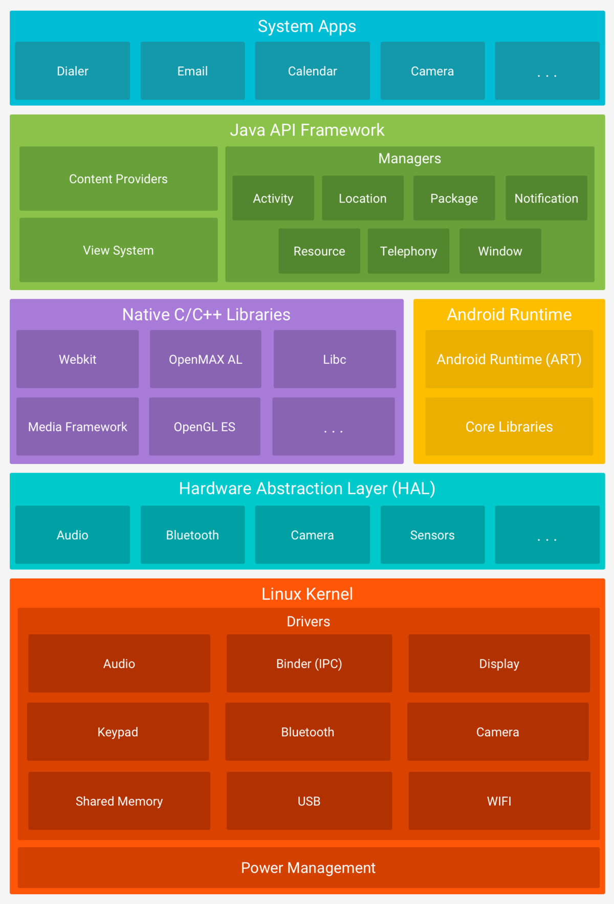
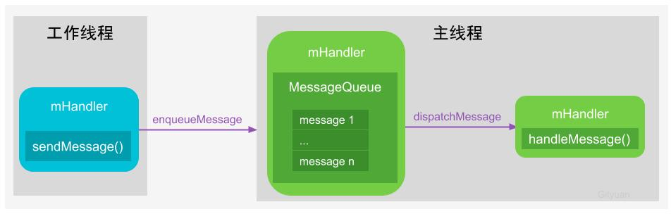

# Android

## Android 五层架构

Android底层内核空间以Linux Kernel作为基石，上层用户空间由Native系统库、虚拟机运行环境、框架层组成，通过系统调用(Syscall)连通系统的内核空间与用户空间。对于用户空间主要采用C++和Java代码编写，通过JNI技术打通用户空间的Java层和Native层(C++/C)，从而连通整个系统。

### 1. 应用层（System Apps）

系统内置的应用程序以及非系统级的应用程序都属于应用层，负责与用户进行直接交互，通常都是用 Java 进行开发的。

### 2. 应用框架层（Java API Framework）

应用框架层为开发人员提供了开发应用程序所需要的 API，我们平常开发应用程序都是调用这一层所提供的 API，当然也包括系统应用。这一层是由 Java 代码编写的，可以称为 Java Framework。主要组件如下：

| 名称                               | 功能描述                                                     |
| :--------------------------------- | :----------------------------------------------------------- |
| Activity Manager（活动管理器）     | 管理各个应用程序生命周期，以及常用的导航回退功能             |
| Location Manager（位置管理器）     | 提供地理位置及定位功能服务                                   |
| Package Manager（包管理器）        | 管理所有安装在Android系统中的应用程序                        |
| Notification Manager（通知管理器） | 使得应用程序可以在状态栏中显示自定义的提示信息               |
| Resource Manager（资源管理器）     | 提供应用程序使用的各种非代码资源，如本地化字符串、图片、布局文件、颜色文件等 |
| Telephony Manager（电话管理器）    | 管理所有的移动设备功能                                       |
| Window Manager（窗口管理器）       | 管理所有开启的窗口程序                                       |
| Content Provider（内容提供者）     | 使得不同应用程序之间可以共享数据                             |
| View System（视图系统）            | 构建应用程序的基本组件                                       |

### 3. 系统运行库层

从 Android 系统框架图上可以看出，系统运行库层分为两部分，分别是 C/C++ 程序库和 Android 运行时库，下面分别进行介绍：

#### 3.1 C/C++ 程序库

| 名称            | 功能描述                                                     |
| --------------- | ------------------------------------------------------------ |
| WebKit          | 一个开源的浏览器网页排版引擎                                 |
| OpenMAX AL      | 一系列跨平台可移植的多媒体解决方案，将系统的媒体回放和记录功能进行抽象，定义更高层次的回放和记录功能。 |
| Libc            | 从BSD继承来的标准C系统函数库，专门为基于嵌入式Linux的设备定制 |
| Media Framework | 多媒体库，支持多种常用的音频、视频格式录制和回放。           |
| OpenGL ES       | 3D绘图函数库                                                 |
| SQLite          | 轻型的关系型数据库引擎                                       |
| SGL             | 底层的2D图形渲染引擎                                         |
| SSL             | 安全套接层，是为网络通信提供安全及数据完整性的一种安全协议   |
| FreeType        | 可移植的字体引擎，它提供统一的接口来访问多种字体格式文件     |

#### 3.2 Android Runtime & 系统库

运行时库又分为核心库和 ART(5.0系统之后，Dalvik 虚拟机被 ART 取代)。核心库提供了 Java 语言核心库的大多数功能，这样开发者可以使用 Java 语言来编写 Android 应用。相较于 JVM，Dalvik 虚拟机是专门为移动设备定制的，允许在有限的内存中同时运行多个虚拟机的实例，并且每一个 Dalvik 应用作为一个独立的 Linux 进程执行。独立的进程可以防止在虚拟机崩溃的时候所有程序都被关闭。而替代 Dalvik 虚拟机的 ART 的机制与 Dalvik 不同。在 Dalvik下，应用每次运行的时候，字节码都需要通过即时编译器转换为机器码，这会拖慢应用的运行效率，而在 ART 环境中，应用在第一次安装的时候，字节码就会预先编译成机器码，使其成为真正的本地应用。

### 4. 硬件抽象层（HAL)

硬件抽象层是位于操作系统内核与硬件电路之间的接口层，其目的在于将硬件抽象化，为了保护硬件厂商的知识产权，它隐藏了特定平台的硬件接口细节，为操作系统提供虚拟硬件平台，使其具有硬件无关性，可在多种平台上进行移植。 从软硬件测试的角度来看，软硬件的测试工作都可分别基于硬件抽象层来完成，使得软硬件测试工作的并行进行成为可能。通俗来讲，就是将控制硬件的动作放在硬件抽象层中。

### 5. Linux 内核层

Android 的核心系统服务基于 Linux 内核，在此基础上添加了部分 Android 专用的驱动。系统的安全性、内存管理、进程管理、网络协议栈和驱动模型等都依赖于该内核。

## 系统启动

**图解：**Android系统启动过程由上图从下往上的一个过程是由Boot Loader引导开机，然后依次 -> Kernel -> Native -> Framework -> App，接来下简要说说每个过程：
 **关于Loader层：**

- Boot ROM: 当手机处于关机状态时，长按Power键开机，引导芯片开始从固化在 ROM里的预设代码开始执行，然后加载引导程序到 RAM；
- Boot Loader：这是启动Android系统之前的引导程序，主要是检查RAM，初始化硬件参数等功能。

**2.1 Linux内核层**

Android平台的基础是Linux内核，比如ART虚拟机最终调用底层Linux内核来执行功能。Linux内核的安全机制为Android提供相应的保障，也允许设备制造商为内核开发硬件驱动程序。

- 启动Kernel的swapper进程(pid=0)：该进程又称为idle进程, 系统初始化过程Kernel由无到有开创的第一个进程, 用于初始化进程管理、内存管理，加载Display，Camera Driver，Binder Driver等相关工作；
- 启动kthreadd进程（pid=2）：是Linux系统的内核进程，会创建内核工作线程kworkder，软中断线程ksoftirqd，thermal等内核守护进程。 kthreadd进程是所有内核进程的鼻祖。

**2.2 硬件抽象层 (HAL)**

Android的硬件驱动与Linux不同，传统的Linux内核驱动完全存在于内核空间中。但是Android在内核外部增加了一个硬件抽象层(HAL-Hardware Abstraction Layer)，把一部分硬件驱动放到了HAL层。

HAL提供标准接口，HAL包含多个库模块，其中每个模块都为特定类型的硬件组件实现一组接口，比如WIFI/Bluetooth模块，当框架API请求访问设备硬件时，Android系统将为该硬件加载相应的库模块。

**为什么Android要这么做呢？**

Linux内核采用了GPL协议，如果硬件厂商需要支持Linux系统，就需要遵照GPL协议公开硬件驱动的源代码，这势必会影响到硬件厂家的核心利益。Android的HAL层运行在用户空间，HAL是一个“空壳”，Android会根据不同的需要，加载不同的动态库。这些动态库由硬件厂家提供。硬件厂家把相关硬件功能写入动态库，内核中只开放一些基本的读写接口操作。这样一些硬件厂家的驱动功能就由内核空间移动到了用户空间。Android的HAL层遵循Apache协议，并不要求它的配套程序，因此厂家提供的驱动库不需要进行开放，保护了硬件厂家的核心利益。

**2.3 Android Runtime & 系统库**

每个应用都在其自己的进程中运行，都有自己的虚拟机实例。ART通过执行DEX文件可在设备运行多个虚拟机，DEX文件是一种专为Android设计的字节码格式文件，经过优化，使用内存很少。ART主要功能包括：预先(AOT)和即时(JIT)编译，优化的垃圾回收(GC)，以及调试相关的支持。

这里的Native系统库主要包括init孵化来的用户空间的守护进程、HAL层以及开机动画等。启动init进程(pid=1),是Linux系统的用户进程， init进程是所有用户进程的鼻祖。

- init进程会孵化出Native Daemons（ueventd、logd、healthd、installd、adbd、lmkd等用户守护进程）；
- init进程还启动 serviceManager(binder服务管家)、 bootanim(开机动画)等重要服务;
- init进程fork Media Server进程，Media Server进程负责启动和管理整个C++ framework，包含AudioFlinger，Camera Service等服务。
- init进程孵化出Zygote进程，Zygote进程是Android系统的第一个Java进程(即虚拟机进程)， Zygote是所有Java进程的父进程，Zygote进程本身是由init进程孵化而来的。

**2.4 Framework层**

Zygote进程，是由init进程通过解析init.rc文件后fork生成的，Zygote进程主要包含：

- 加载ZygoteInit类，注册Zygote Socket服务端套接字
- 加载虚拟机
- 提前加载类 preloadClasses
- 提前加载资源 preloadResources
- `System Server`进程，是由`Zygote`进程`fork`而来， `SystemServer`是`Zygote`孵化的第一个进程，`System  Server`负责启动和管理整个Java  framework，包含ActivityManager，WindowManager，PackageManager，PowerManager等服务。

**2.5 App层**

- Zygote进程孵化出的第一个App进程是Launcher，这是用户看到的桌面App；
- Zygote进程还会创建Browser，Phone，Email等App进程，每个App至少运行在一个进程上。
- 所有的App进程都是由Zygote进程fork生成的。

**2.6 Syscall && JNI**

- Native与Kernel之间有一层系统调用(SysCall)层，见Linux系统调用(Syscall)原理;
- Java层与Native(C/C++)层之间的纽带JNI，见Android JNI原理分析。

## **通信方式**

无论是Android系统，还是各种Linux衍生系统，各个组件、模块往往运行在各种不同的进程和线程内，这里就必然涉及进程/线程之间的通信。对于IPC(Inter-Process Communication,  进程间通信)，Linux现有管道、消息队列、共享内存、套接字、信号量、信号这些IPC机制，Android额外还有Binder  IPC机制。

Android OS中的Zygote进程的IPC采用的是Socket机制，在上层system server、media  server以及上层App之间更多的是采用Binder  IPC方式来完成跨进程间的通信。对于Android上层架构中，很多时候是在同一个进程的线程之间需要相互通信，例如同一个进程的主线程与工作线程之间的通信，往往采用的Handler消息机制。想深入理解Android内核层架构，必须先深入理解Linux现有的IPC机制；对于Android上层架构，则最常用的通信方式是Binder、Socket、Handler，当然也有少量其他的IPC方式，比如杀进程Process.killProcess()采用的是signal方式。下面说说Binder、Socket、Handler：

**3.1 Binder**

Binder作为Android系统提供的一种IPC机制，无论从系统开发还是应用开发，都是Android系统中最重要的组成，也是最难理解的一块知识点，想了解为什么Android要采用Binder作为IPC机制？ 可查看[Binder系列—开篇](http://gityuan.com/2015/10/31/binder-prepare/)。深入了解Binder机制，最好的方法便是阅读源码，借用Linux鼻祖Linus Torvalds曾说过的一句话：Read The Fucking Source Code。下面简要说说Binder IPC原理。

**Binder IPC原理**

Binder通信采用c/s架构，从组件视角来说，包含Client、Server、ServiceManager以及binder驱动，其中ServiceManager用于管理系统中的各种服务。

**3.2 Socket**

Socket通信方式也是C/S架构，比Binder简单很多。在Android系统中采用Socket通信方式的主要有：

- zygote：用于孵化进程，system_server创建进程是通过socket向zygote进程发起请求；
- installd：用于安装App的守护进程，上层PackageManagerService很多实现最终都是交给它来完成；
- lmkd：lowmemorykiller的守护进程，Java层的LowMemoryKiller最终都是由lmkd来完成；
- adbd：这个也不用说，用于服务adb；
- logcatd:这个不用说，用于服务logcat；
- vold：即volume Daemon，是存储类的守护进程，用于负责如USB、Sdcard等存储设备的事件处理。

等等还有很多，这里不一一列举，Socket方式更多的用于Android framework层与native层之间的通信。Socket通信方式相对于binder比较简单，这里省略。

**3.3 Handler**
Binder/Socket用于进程间通信，而Handler消息机制用于同进程的线程间通信，Handler消息机制是由一组MessageQueue、Message、Looper、Handler共同组成的，为了方便且称之为Handler消息机制。

有人可能会疑惑，为何Binder/Socket用于进程间通信，能否用于线程间通信呢？答案是肯定，对于两个具有独立地址空间的进程通信都可以，当然也能用于共享内存空间的两个线程间通信，这就好比杀鸡用牛刀。接着可能还有人会疑惑，那handler消息机制能否用于进程间通信？答案是不能，Handler只能用于共享内存地址空间的两个线程间通信，即同进程的两个线程间通信。很多时候，Handler是工作线程向UI主线程发送消息，即App应用中只有主线程能更新UI，其他工作线程往往是完成相应工作后，通过Handler告知主线程需要做出相应地UI更新操作，Handler分发相应的消息给UI主线程去完成，如下图：

由于工作线程与主线程共享地址空间，即Handler实例对象mHandler位于线程间共享的内存堆上，工作线程与主线程都能直接使用该对象，只需要注意多线程的同步问题。工作线程通过mHandler向其成员变量MessageQueue中添加新Message，主线程一直处于loop()方法内，当收到新的 Message 时按照一定规则分发给相应的handleMessage() 方法来处理。所以说，Handler消息机制用于同进程的线程间通信，其核心是线程间共享内存空间，而不同进程拥有不同的地址空间，也就不能用handler来实现进程间通信。

上图只是Handler消息机制的一种处理流程，是不是只能工作线程向UI主线程发消息呢，其实不然，可以是UI线程向工作线程发送消息，也可以是多个工作线程之间通过handler发送消息。

 要理解framework层源码，掌握这3种基本的进程/线程间通信方式是非常有必要，当然Linux还有不少其他的IPC机制，比如共享内存、信号、信号量，在源码中也有体现，如果想全面彻底地掌握Android系统，还是需要对每一种IPC机制都有所了解。

## 参考文献

- [Android系统五层架构](https://www.jianshu.com/p/13da6c2e537f)
- [一文带你掌握 Android 系统架构](https://zhuanlan.zhihu.com/p/130392136)
- [Android 操作系统架构开篇](http://gityuan.com/android/)