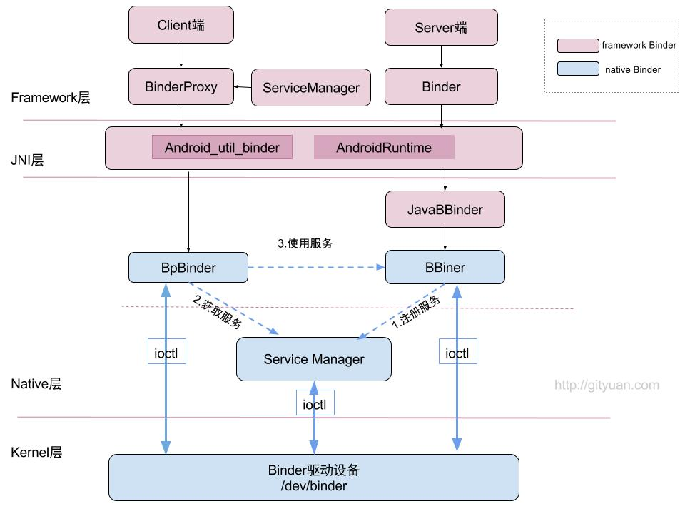
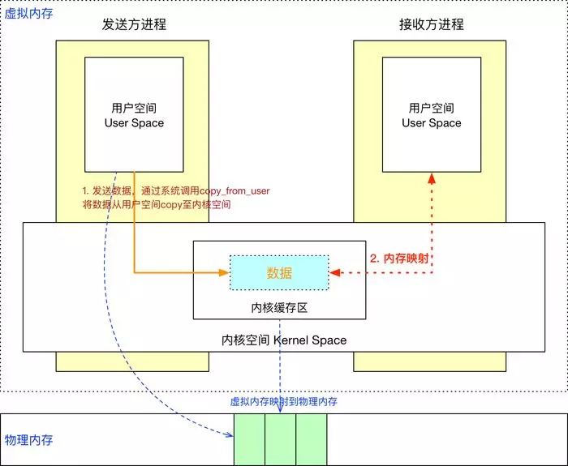

# Binder

## Binder 架构

 Android 应用程序是由 Activity、Service、Broadcast Receiver 和 Content Provide  四大组件中的一个或者多个组成的。有时这些组件运行在同一进程，有时运行在不同的进程。这些进程间的通信就依赖于 Binder IPC  机制。不仅如此，Android  系统对应用层提供的各种服务如：ActivityManagerService、PackageManagerService 等都是基于 Binder IPC 机制来实现的。Binder 机制在 Android 中的位置非常重要。

Binder通信采用C/S架构，从组件视角来说，包含Client、Server、ServiceManager以及binder驱动，其中ServiceManager用于管理系统中的各种服务。

可以看出无论是注册服务和获取服务的过程都需要ServiceManager，需要注意的是此处的Service  Manager是指Native层的ServiceManager（C++），并非指framework层的ServiceManager(Java)。ServiceManager是整个Binder通信机制的大管家，是Android进程间通信机制Binder的守护进程，要掌握Binder机制，首先需要了解系统是如何首次启动Service Manager。当Service Manager启动之后，Client端和Server端通信时都需要先获取Service Manager接口，才能开始通信服务。

图中Client/Server/ServiceManage之间的相互通信都是基于Binder机制。既然基于Binder机制通信，那么同样也是C/S架构，则图中的3大步骤都有相应的Client端与Server端。

1. **注册服务(addService)**：Server进程要先注册Service到ServiceManager。该过程：Server是客户端，ServiceManager是服务端。
2. **获取服务(getService)**：Client进程使用某个Service前，须先向ServiceManager中获取相应的Service。该过程：Client是客户端，ServiceManager是服务端。
3. **使用服务**：Client根据得到的Service信息建立与Service所在的Server进程通信的通路，然后就可以直接与Service交互。该过程：client是客户端，server是服务端。

图中的Client,Server,Service Manager之间交互都是虚线表示，是由于它们彼此之间不是直接交互的，而是都通过与Binder驱动进行交互的，从而实现IPC通信方式。其中Binder驱动位于内核空间，Client,Server,Service Manager位于用户空间。Binder驱动和Service  Manager可以看做是Android平台的基础架构，而Client和Server是Android的应用层，开发人员只需自定义实现client、Server端，借助Android的基本平台架构便可以直接进行IPC通信。

[Binder系列—开篇](http://gityuan.com/2015/10/31/binder-prepare/)

### 整体架构

binder在framework层，采用JNI技术来调用native(C/C++)层的binder架构，从而为上层应用程序提供服务。  在native层中，binder是C/S架构，分为Bn端(Server)和Bp端(Client)。对于framework层，在命名与架构上与Native非常相近，同样实现了一套IPC通信架构。

- 图中红色代表整个framework层 binder架构相关组件；    
- BinderProxy类代表Client端，Binder类代表Server端；
- 图中蓝色代表Native层Binder架构相关组件；
- 上层framework层的Binder逻辑是建立在Native层架构基础之上的，核心逻辑都是交予Native层方法来处理。
- framework层的ServiceManager类与Native层的功能并不完全对应，framework层的ServiceManager类的实现最终是通过BinderProxy传递给Native层来完成的。

### Binder进程与线程

对于底层Binder驱动，通过`binder_procs`链表记录所有创建的binder_proc结构体，binder驱动层的每一个binder_proc结构体都与用户空间的一个用于binder通信的进程一一对应，且每个进程有且只有一个`ProcessState`对象，这是通过单例模式来保证的。在每个进程中可以有很多个线程，每个线程对应一个IPCThreadState对象，IPCThreadState对象也是单例模式，即一个线程对应一个IPCThreadState对象，在Binder驱动层也有与之相对应的结构，那就是Binder_thread结构体。在binder_proc结构体中通过成员变量`rb_root threads`，来记录当前进程内所有的binder_thread。

Binder线程池：每个Server进程在启动时会创建一个binder线程池，并向其中注册一个Binder线程；之后Server进程也可以向binder线程池注册新的线程，或者Binder驱动在探测到没有空闲binder线程时会主动向Server进程注册新的binder线程。对于一个Server进程有一个最大Binder线程数限制，默认为16个binder线程，例如Android的system_server进程就存在16个线程。对于所有Client端进程的binder请求都是交由Server端进程的binder线程来处理的。

[Binder系列7—framework层分析](http://gityuan.com/2015/11/21/binder-framework/)

### 为什么是Binder?

Linux 现有的 IPC 方式：

1. **管道**：在创建时分配一个page大小的内存，缓存区大小比较有限，只能用于共同祖先的进程之间的通信；
2. **命名管道**：与管道类似，但允许在任何两个进程之间通信；
3.  **信号**: 不适用于信息交换，用于通知接收进程有某种事情发生，更适用于进程中断控制，比如非法内存访问，杀死某个进程等；
4. **消息队列**：消息队列是消息的连接表，包括POSIX消息对和System V消息队列。有足够权限的进程可以向队列中添加消息，被赋予读权限的进程则可以读走队列中的消息。消息队列克服了信号承载信息量少，管道只能传递无格式字节流以及缓冲区大小受限等缺点。消息队列信息复制两次，额外的CPU消耗；不合适频繁或信息量大的通信；
5. **信号量**：常作为一种锁机制，防止某进程正在访问共享资源时，其他进程也访问该资源。因此，主要作为进程间以及同一进程内不同线程之间的同步手段。
6. **共享内存**：无须复制，共享缓冲区直接附加到进程虚拟地址空间，速度快。这是针对其他通信机制运行效率较低而设计的。它往往与其他通信机制，如信号量结合使用，以达到进程间的同步及互斥；
7.  **套接字**：作为更通用的接口，传输效率低，主要用于不通机器或跨网络的通信；

Android的内核也是基于Linux内核，为何不直接采用Linux现有的进程IPC方案呢？

**拷贝次数**

传统 IPC 通信流程（共享内存机制除外）

这种传统方式存在两个问题：

- 需要做2次数据拷贝操作
- 接收方进程在接收数据之前，需要事先分配空间来存取数据，但不知道事先要分配多大的空间，这样就可能存在一种在空间上的浪费

Binder通信只需要一次拷贝。Linux是使用的虚拟内存寻址方式，有如下特性：

- 用户空间的虚拟内存地址是映射到物理内存中的
- 对虚拟内存的读写实际上是对物理内存的读写，这个过程就是内存映射
- 这个内存映射过程是通过系统调用mmap()来实现的

- Binder借助了内存映射的方法，在内核空间和接收方用户空间的数据缓存区之间做了一层内存映射，就相当于直接拷贝到了接收方用户空间的数据缓存区，从而减少了一次数据拷贝

参考：https://www.jianshu.com/p/73fafb9b19ce

总结：

| IPC                  | 拷贝次数 |
| -------------------- | -------- |
| 共享内存             | 0        |
| Binder               | 1        |
| Socket/管道/消息队列 | 2        |

**稳定性**

Binder 基于 C/S 架构，Client有什么需求就发送给Server去完成，架构清晰、职责明确又相互独立，自然稳定性更好。共享内存虽然无需拷贝，需要充分考虑到访问临界资源的并发同步问题，否则可能会出现死锁等问题。从稳定性角度看，Binder架构优越于共享内存。

**安全性**

Android 作为一个开放性的平台，市场上有各类海量的应用供用户选择安装，因此安全性对于 Android 平台而言极其重要。作为用户当然不希望我们下载的 APP 偷偷读取我的通信录，上传我的隐私数据，后台偷跑流量、消耗手机电量。

首先传统的 IPC 接收方无法获得对方可靠的进程用户ID/进程ID（UID/PID），从而无法鉴别对方身份。Android 为每个安装好的  APP 分配了自己的 UID，故而进程的 UID 是鉴别进程身份的重要标志。传统的 IPC 只能由用户在数据包中填入  UID/PID，但这样不可靠，容易被恶意程序利用。可靠的身份标识只有由 IPC 机制在内核中添加。其次传统的 IPC  访问接入点是开放的，只要知道这些接入点的程序都可以和对端建立连接，不管怎样都无法阻止恶意程序通过猜测接收方地址获得连接。同时 Binder  既支持实名 Binder，又支持匿名 Binder，安全性高。

**语言层面**：

Linux基于面向过程的C语言，而Android基于面向对象的Java语言，而Binder也符合面向对象思想，将进程间通信转化为通过对某个Binder对象的引用调用该对象的方法，而其独特之处在于Binder对象是一个可以跨进程引用的对象，它的实体位于一个进程中，而它的引用却遍布于系统的各个进程之中。可以从一个进程传给其它进程，让大家都能访问同一Server，就像将一个对象或引用赋值给另一个引用一样。Binder模糊了进程边界，淡化了进程间通信过程，整个系统仿佛运行于同一个面向对象的程序之中。

在不同的场景下往往采用不同的IPC，如Android的Zygote便采用Socket机制，Android中的 Kill Process 采用 single 机制，而 Binder 更多则用在 system server 进程与上层 APP 层的 IPC交互。

Binder的优势总结：

| 优势   | 描述                                         |
| ------ | -------------------------------------------- |
| 性能   | 只需要一次数据拷贝，性能上仅仅次于共享内存。 |
| 稳定性 | 基于C/S架构，职责明确、架构清晰，稳定性好。  |
| 安全性 | 为每个APP分配UID/PID，APP 身份可靠。         |

参考：

- https://www.zhihu.com/question/39440766/answer/89210950

- https://zhuanlan.zhihu.com/p/35519585

